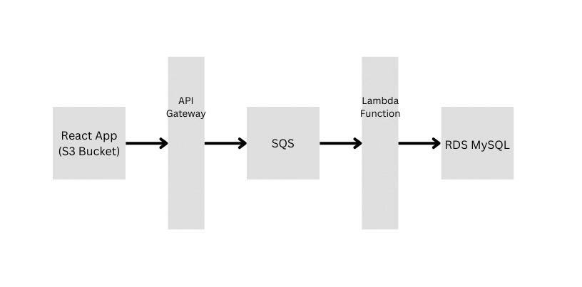

# Single-Page Web Application with AWS Database Integration

##### Please follow the following steps for running the application:

1. Download the zip and extraxct it, make sure package.json and package-lock.json are present inside the directory.
2. Run the command to install the required modules for the React app.

   ```
   npm install
   ```
3. Once the modules are installed, you can run the react app usign following command.

   ```
   npm start
   ```
4. The app would be running on http://localhost:3000 and the data is sent to AWS RDS for storage.

---

##### Following is the data flow from React app to the RDS database in AWS:



1. The data is sent from the React app to the API Gateway.
2. At the deployed API Gateway the data is forwarded inside the SQS queue.
3. The message inside SQS queue is sent to the Lambda function for which it acts as a trigger.
4. Once the lambda function is triggered it make connection with the RDS database and sends the query for storing data inside database.
5. The RDS database based on MySQL stores the data inside it and checks for email as a primary key.

---

##### Database scheme (testuser-16-database):

* Instance name: testuser-16-database
* Database name: testuser_16_database
* Schema: Users(Name, **Email**(Primary Key), Location)

---

##### Lambda Function and RDS:

* The lambda function uses Python for the handler_function, and the pymysql library.
* The data from the SQS queue is fetched and sent to the RDS, the credentials included as environment variables.

---

##### Confusions:

1. The app has to be created using React or a single page using HTML, CSS and JS. There was ambiguity in the question, React was also written.
2. If data for card has to be fetched, if yes, it can be added easily, taking the data from RDS using Lambda function and passing to the SQS Queue which sends the message to GET method in API Gateway and easily integrated in React app.
3. If app is to be hosted on Cloudfront, and how to host the React app, index.html will not alone work.
